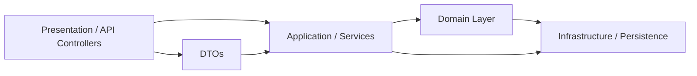

# Documentación del Proyecto MillionApi [API RestFull]

---

[](LICENSE)
[](https://dotnet.microsoft.com/)
[](https://www.mongodb.com/)
[](https://domainlanguage.com/ddd/)
[](https://www.mongodb.com/)
[](https://restfulapi.net/)
[](https://blog.cleancoder.com/)
[](https://owasp.org/www-project-proactive-controls/)
[](https://devops.com/shifting-security-to-the-left/)
[](https://nunit.org/)
[](https://insomnia.rest/)
[](https://www.docker.com/)
[](https://docs.docker.com/compose/)

---

## 📖 Descripción

MillionApi es un servicio backend desarrollado en C# (.NET Core 9) que ofrece una API para manejar operaciones del dominio (negocio) de “Million”. El proyecto está organizado bajo principios como Arquitectura Limpia (Clean Architecture) y los principios SOLID, con capas claramente separadas: presentación, dominio, infraestructura, etc.

**El ciclo de vida de desarrollo del software seguro (SSDLC)**

Como Especialista en Seguridad de la Información hago incapié en la implementación de procesos de seguridad eficaces y la importancia que los equipos apliquen el enfoque shift left, es decir, tomen las medidas de protección desde las primeras etapas del SDLC y en cada una de ellas. Hay ciertos pasos que se pueden seguir en cada etapa para lograr el ciclo de vida de desarrollo del software seguro (SSDLC), al final del proyecto se realiza la evaluación de componentes para identificar posibles vulnerabilidades en librerías de terceros usadas por NuGet.


---

## ⚙ Estructura / Arquitectura

A continuación se muestra una vista de alto nivel de la organización del código:

```
MillionApi/
├── Application/Services
├── Domain/
├── Dtos/
├── Infrastructure/Persistence
├── Presentation/Controllers
├── Properties/
├── Program.cs
├── MillionApi.csproj
├── Dockerfile

Tests
├── Application
├── Domain
├── Infrastructure
├── Presentation
```

### Capas y responsabilidades

| Capa | Propósito | Contenido típico |
|------|-----------|-------------------|
| **Presentation / Controllers** | Expone la API (endpoints HTTP) | Controllers, modelos de entrada/salida |
| **Application / Services** | Orquestación de casos de uso | Servicios de aplicación que coordinan repositorios y lógica del dominio |
| **Domain** | Lógica central del negocio | Entidades, interfaces de repositorio (abstracciones), reglas de negocio |
| **Dtos** | Modelos de transferencia | Data Transfer Objects usados en la comunicación entre capas |
| **Infrastructure / Persistence** | Implementaciones concretas | Persistencia (EF Core, accesos a BD), adaptadores hacia recursos externos |
| **Properties / Configuración** | Archivos de configuración | appsettings, constantes del proyecto, etc. |
| **Tests** | Directorio de Pruebas Unitarias | Ejecutar la validación de los componentes del API Rest |

Este diseño refleja la filosofía de **Clean Architecture**, donde las dependencias apuntan hacia el dominio (núcleo), y las capas externas (infraestructura, presentación) dependen de abstracciones definidas en el dominio o en la capa de aplicación.

### Diagrama de alto nivel (Mermaid)



---

## 🧩 Principios y metodologías aplicadas

- **SOLID**:  
  1. *Single Responsibility* — Cada clase tiene una única responsabilidad (por ejemplo, un servicio de aplicación no hace persistencia directamente).  
  2. *Open/Closed* — Se pueden extender servicios usando interfaces y herencia/composición sin modificar clases existentes.  
  3. *Liskov Substitution* — Las implementaciones concretas de interfaces pueden sustituirlas sin cambios inesperados.  
  4. *Interface Segregation* — Se prefieren interfaces específicas y pequeñas (en lugar de una interfaz gigante).  
  5. *Dependency Inversion* — Las capas superiores no dependen de detalles; dependen de abstracciones definidas en capas centrales.

- **Arquitectura Limpia / Hexagonal / Ports & Adapters**  
  - El dominio (entidades, interfaces) es el núcleo independiente de detalles externos.  
  - Las implementaciones (adaptadores) están en la capa de infraestructura.  
  - La lógica de casos de uso está en la capa de aplicación, mediando entre presentación e infraestructura.  
  - La capa de presentación sólo depende de los servicios de aplicación y DTOs.

- **Inversión de dependencias / Inyección de dependencias**  
  - Se utilizan contenedores de DI para inyectar las implementaciones concretas de repositorios, adaptadores, etc.  
  - La configuración de dependencias se hace en `Program.cs` (o en startup) vinculando interfaces con implementaciones.

- **DTOs y mapeo**  
  - Para evitar acoplamiento entre la representación externa (API) y las entidades del dominio, se usan objetos DTO y mapeo (puede usarse herramientas como AutoMapper).

- **Separación de responsabilidades**  
  - Cada capa tiene responsabilidades claras (presentación, lógica de negocio, persistencia).  
  - Evitar “código espagueti” mezclando capas.

- **Pruebas (tests)**  
  - Usar pruebas unitarias para la capa de dominio y servicios de aplicación.  
  - Usar pruebas de integración para repositorios e infraestructura.

- **Validación de Vulnerabilidades en los Paquetes o Shadow Mapping**
  ```bash
  cd MillionApi
  # Análisis de Dependencias
  dotnet list package --vulnerable --include-transitive
  # Build con todos los Analizadores
  dotnet build /p:AnalysisMode=AllEnabledByDefault /warnaserror
  # Restaurar y ver warnings de seguridad
  dotnet restore
  dotnet build --verbosity normal | grep -i "warning\|security"
  ```

---

## 🚀 Cómo levantar el proyecto (guía rápida)

Sigue estos pasos para ejecutar la API localmente:

1. Clona el repositorio:
   ```bash
   git clone https://github.com/imeshinnovation/MillionApi.git
   cd MillionApi
   ```

2. Configura las cadenas de conexión en `appsettings.json` o `appsettings.Development.json`.

3. Restaura paquetes y compila:
   ```bash
   dotnet restore
   dotnet build
   ```

4. Ejecuta la API:
   ```bash
   dotnet run --project MillionApi/MillionApi.csproj
   ```

5. El Proyecto se puede desplegar en Arquitectura Docker:

  
   ```bash

   Servicios:
   - mongodbapi
   - millionapi

   dotnet publish -c Release -o ./publish
   docker-compose up -d --build

   ```
6. Consumir API Rest:

```bash
  URL EndPoint:
  - http://localhost:8080/api/Property
  ```

7. Se incluye Set de Pruebas.

```bash
  Cliente Rest Insomnia:
  - Insomnia_MillionApi.yaml
```


---

## 📂 Endpoints de ejemplo

| Verbo | Ruta | Descripción | Parámetros / Body |
|-------|------|-------------|---------------------|
| GET   | /api/Property | Obtiene todos los items por nombre, dirección, precio mínimo, precio máximo | — |
| GET   | /api/Property/{id} | Obtiene los registros de un item por Id (ObjectId) | — |
| POST  | /api/Property | Crea un nuevo item | `{ "name": "...", "valor": 123 }` |

---

## 🧪 Pruebas Unitarias con NUnit (tests)

```bash
dotnet test
Resumen de pruebas: total: 7; con errores: 0; correcto: 7;
```

---

## 📝 Licencia

**Licencia del proyecto:** MIT

## 👤 Autor

**Alexander Rubio Cáceres**  
- Ingeniero de Software
- Especialista en Seguridad de la Información
- Desarrollador FullStack Senior

### Email:
📧 imesh.innovation@gmail.com | 📧 sigueme.android@gmail.com  
