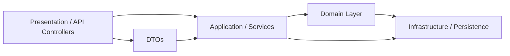

# MillionApi

**Autor / Owner**: Alexander Rubio Cáceres  
**Contactos**:  
- imesh.innovation@gmail.com  
- sigueme.android@gmail.com  

---

## 📖 Descripción

MillionApi es un servicio backend desarrollado en C# (.NET) que ofrece una API para manejar operaciones del dominio (negocio) de “Million”. El proyecto está organizado bajo principios como Arquitectura Limpia (Clean Architecture) y los principios SOLID, con capas claramente separadas: presentación, dominio, infraestructura, etc.


---

## ⚙ Estructura / Arquitectura

A continuación se muestra una vista de alto nivel de la organización del código:

```
MillionApi/
├── Application/Services
├── Domain/
├── Dtos/
├── Infrastructure/Persistence
├── Presentation/Controllers
├── Properties/
├── Program.cs
├── MillionApi.csproj
├── Dockerfile
└── Tests
```

### Capas y responsabilidades

| Capa | Propósito | Contenido típico |
|------|-----------|-------------------|
| **Presentation / Controllers** | Expone la API (endpoints HTTP) | Controllers, modelos de entrada/salida |
| **Application / Services** | Orquestación de casos de uso | Servicios de aplicación que coordinan repositorios y lógica del dominio |
| **Domain** | Lógica central del negocio | Entidades, interfaces de repositorio (abstracciones), reglas de negocio |
| **Dtos** | Modelos de transferencia | Data Transfer Objects usados en la comunicación entre capas |
| **Infrastructure / Persistence** | Implementaciones concretas | Persistencia (EF Core, accesos a BD), adaptadores hacia recursos externos |
| **Properties / Configuración** | Archivos de configuración | appsettings, constantes del proyecto, etc. |
| **Tests** | Archivos de Pruebas Unitarias | Ejecutar la validación de los componentes del API Rest |

Este diseño refleja la filosofía de **Clean Architecture**, donde las dependencias apuntan hacia el dominio (núcleo), y las capas externas (infraestructura, presentación) dependen de abstracciones definidas en el dominio o en la capa de aplicación.

### Diagrama de alto nivel (Mermaid)



---

## 🧩 Principios y metodologías aplicadas

- **SOLID**:  
  1. *Single Responsibility* — Cada clase tiene una única responsabilidad (por ejemplo, un servicio de aplicación no hace persistencia directamente).  
  2. *Open/Closed* — Se pueden extender servicios usando interfaces y herencia/composición sin modificar clases existentes.  
  3. *Liskov Substitution* — Las implementaciones concretas de interfaces pueden sustituirlas sin cambios inesperados.  
  4. *Interface Segregation* — Se prefieren interfaces específicas y pequeñas (en lugar de una interfaz gigante).  
  5. *Dependency Inversion* — Las capas superiores no dependen de detalles; dependen de abstracciones definidas en capas centrales.

- **Arquitectura Limpia / Hexagonal / Ports & Adapters**  
  - El dominio (entidades, interfaces) es el núcleo independiente de detalles externos.  
  - Las implementaciones (adaptadores) están en la capa de infraestructura.  
  - La lógica de casos de uso está en la capa de aplicación, mediando entre presentación e infraestructura.  
  - La capa de presentación sólo depende de los servicios de aplicación y DTOs.

- **Inversión de dependencias / Inyección de dependencias**  
  - Se utilizan contenedores de DI para inyectar las implementaciones concretas de repositorios, adaptadores, etc.  
  - La configuración de dependencias se hace en `Program.cs` (o en startup) vinculando interfaces con implementaciones.

- **DTOs y mapeo**  
  - Para evitar acoplamiento entre la representación externa (API) y las entidades del dominio, se usan objetos DTO y mapeo (puede usarse herramientas como AutoMapper).

- **Separación de preocupaciones**  
  - Cada capa tiene responsabilidades claras (presentación, lógica de negocio, persistencia).  
  - Evitar “código espagueti” mezclando capas.

- **Pruebas (tests)**  
  - Usar pruebas unitarias para la capa de dominio y servicios de aplicación.  
  - Usar pruebas de integración para repositorios e infraestructura.

---

## 🚀 Cómo levantar el proyecto (guía rápida)

Sigue estos pasos para ejecutar la API localmente:

1. Clona el repositorio:
   ```bash
   git clone https://github.com/imeshinnovation/MillionApi.git
   cd MillionApi
   ```

2. Configura las cadenas de conexión en `appsettings.json` o `appsettings.Development.json`.

3. Restaura paquetes y compila:
   ```bash
   dotnet restore
   dotnet build
   ```

4. Ejecuta la API:
   ```bash
   dotnet run --project MillionApi
   ```

5. El Proyecto se puede desplegar en un contenedor Docker:
   ```bash
   docker build -t millionapi .
   docker run -p 5000:80 millionapi
   ```

6. Accede a los endpoints (por ejemplo, usando Postman) o al archivo `MillionApi.http` que contiene ejemplos de peticiones.

---

## 📂 Endpoints de ejemplo

| Verbo | Ruta | Descripción | Parámetros / Body |
|-------|------|-------------|---------------------|
| GET   | /api/Property | Obtiene todos los items | — |
| GET   | /api/Property/{id} | Obtiene los registros de un item | — |
| POST  | /api/Property | Crea un nuevo item | `{ "name": "...", "valor": 123 }` |

---

## 🧪 Pruebas Unitarias con NUnit (tests)

```bash
dotnet test
Resumen de pruebas: total: 7; con errores: 0; correcto: 7;
```

---


---

## 📝 Licencia

**Licencia del proyecto:** MIT

---

## 🙋‍♂️ Contacto

Alexander Rubio Cáceres  
Emails:
  - imesh.innovation@gmail.com  
  - sigueme.android@gmail.com  
